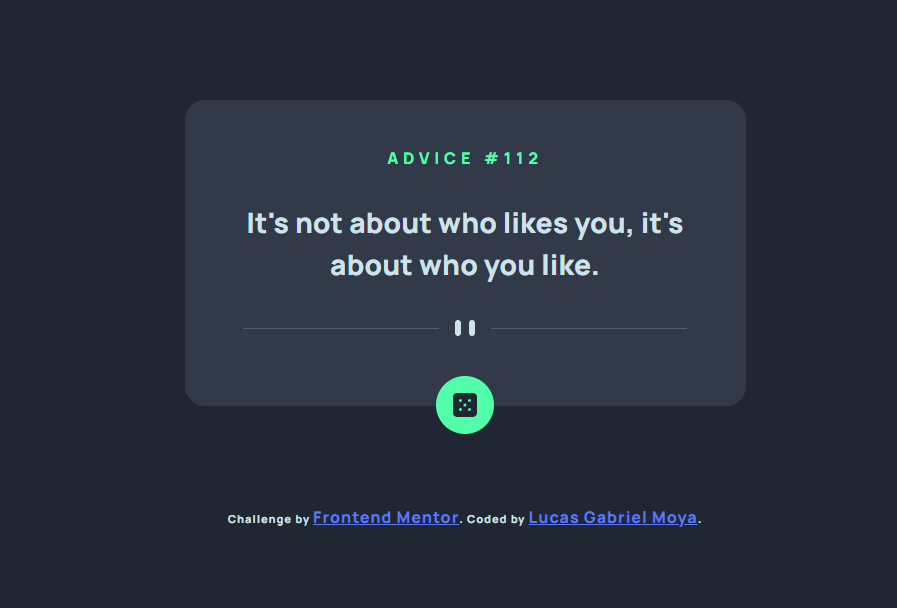

<h1 align="center">
Advice generator

## Sobre o Projeto
Este projeto foi desenvolvido para o [desafio do gerador de conselhos no Frontend Mentor](https://www.frontendmentor.io/challenges/advice-generator-app-QdUG-13db).

### Links

- Solution URL: [https://lucasgabrielgerador-de-frases-five.vercel.app/](https://lucasgabrielgerador-de-frases-five.vercel.app/)

### Project Screenshot

### Construído com

- HTML5
- CSS
- Flexbox
- Javascript
- API do [Advice Slip JSON API](https://api.adviceslip.com/)

## Lucas Gabriel Moya

- Website - [https://lucasgabrielmoya-nu.vercel.app/](https://lucasgabrielmoya-nu.vercel.app/)
- Linkedin - [Lucas Gabriel Moya](https://www.linkedin.com/in/lucas-gabriel-moya/)